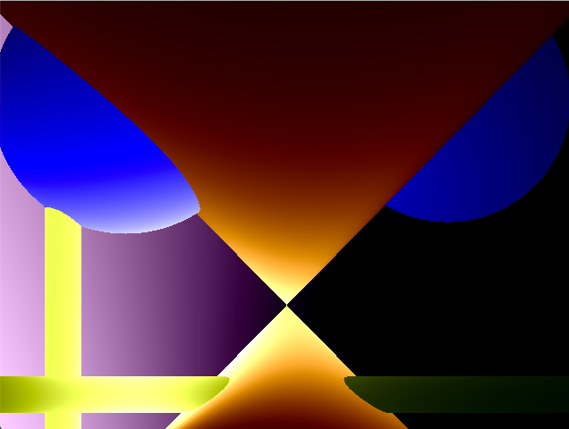

# Rtv1 (Raytracer version 1)
[42 School](https://www.42.fr/) project.

##Description

Rtv1 is a simple raytracer that can display 4 simple geometrical shapes: a plane, a sphere, a cone and a cylinder and a light.

##Warning

This project is not finished , it misses shadows , a better camera for new angles and quite a lot of optimisation.

##Picture

